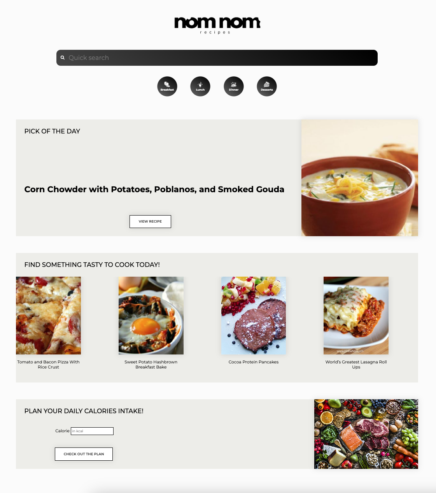
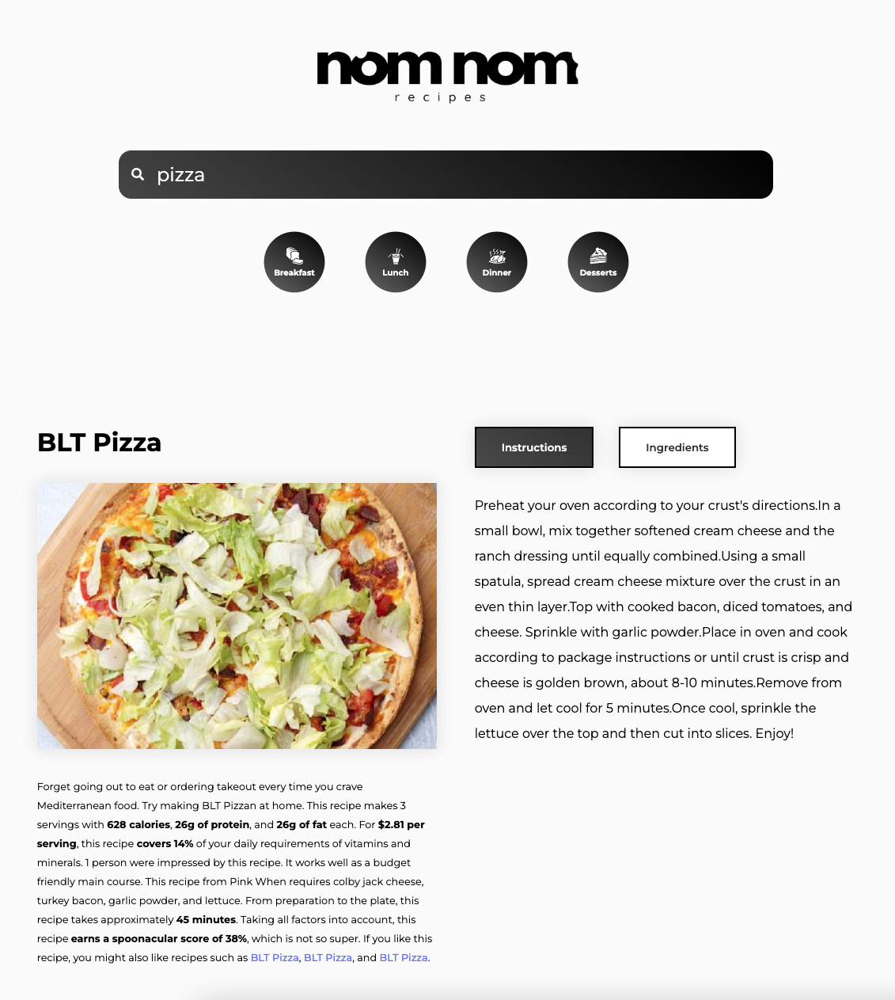
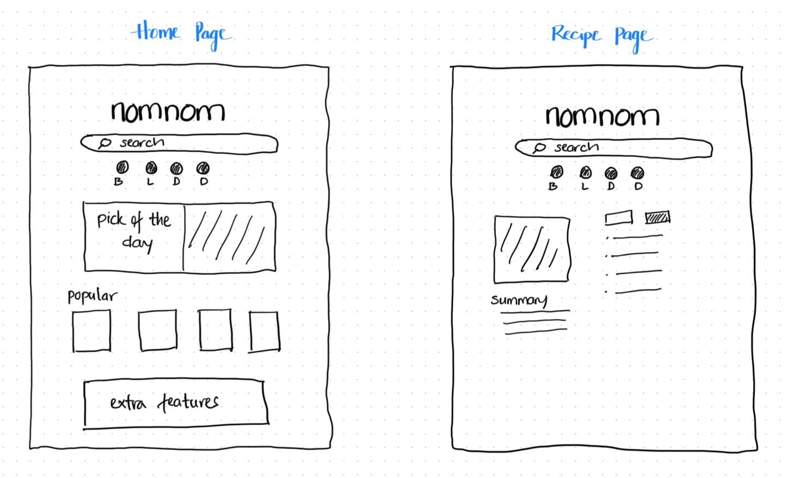

# NomNom Recipes - React App

This React-based recipe app, powered by Spoonacular API, showcases my recent two-week immersion in React development. With features like random meal recipe discovery, personalized meal plan generation based on daily calorie intake goals, and quick lunch idea searches, users can easily explore, plan, and prepare meals tailored to their tastes and dietary needs.

[Click here to see my live project!](https://nomnomrecipe.surge.sh/)

## Planning & Problem Solving

### Wireframe

This wireframe showcases my MVP. The idea was to show a clean, simple front page with options to explore further in the app. I planned to have multiple pages according number of components in the app, they all linked via buttons or clickable images. Display all the dishes (images) in form of slideshow or grid.  

[Click here to see my Trello board!](https://trello.com/b/OS1OSUgR/nomnom)

## 🚀 Cool tech

- html, css, javaScript, 
- react, react-router-dom, react-icons, react-splide, axios
- vite

## 😱 Bugs to fix 💩

- Forget to copy current data when use useState
- Take a bit time to solve map function for object
- Some CSS when styling images

## 😭 Lessons learnt
It is very benefitial to have a wireframe drawed out before starting the project. It helps to build the MVP a lot quicker. I was really enjoy working on this project, due to time allowance I took time to practice and review material and some other feature online. 
However, there are some improvements needed. For instance, I didn't plan in details what should I do after the MVP, what features should add on and styling is most time consuming part but I didn't have a clear idea for it.  

## ✅ Future features
- Add sending email feature
- Instruction videos (if can get the source)
- Convertor for measurement units (US Customary and Metric)
- Improve UX design (make the instruction easier to read)
- User function (for add to favourites or send newsletter)